### 其实这是看海贼王的感想
***
先上图吧：
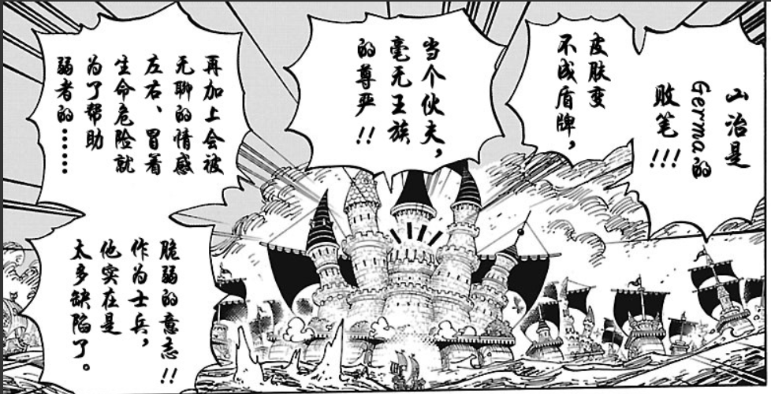
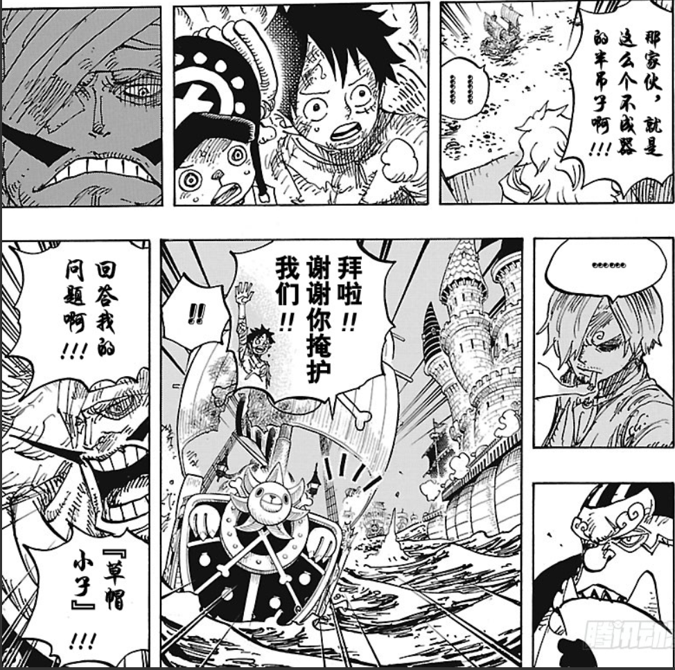
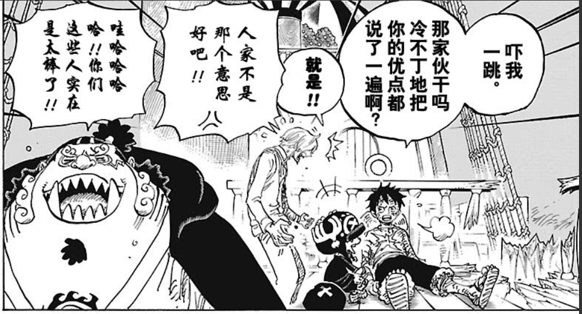

故事的背景是，路飞他们去大妈那边去解救山治。山治是被他的一家人所厌弃的人，而那他作为联姻大妈的工具，以获得大妈的力量。可是大妈直接想杀了他的一家人直接抢夺力量。这计谋自然是被路飞一伙破坏，之后山治家人也协助路飞他们逃出。要分别之时，便有了上图的那一幕。这不禁让我想起了山治的大妈那边的结婚对象，布林，他们两个儿时的命运是那么想象，只不过一个选择了伪装，一个一直保持这善良。

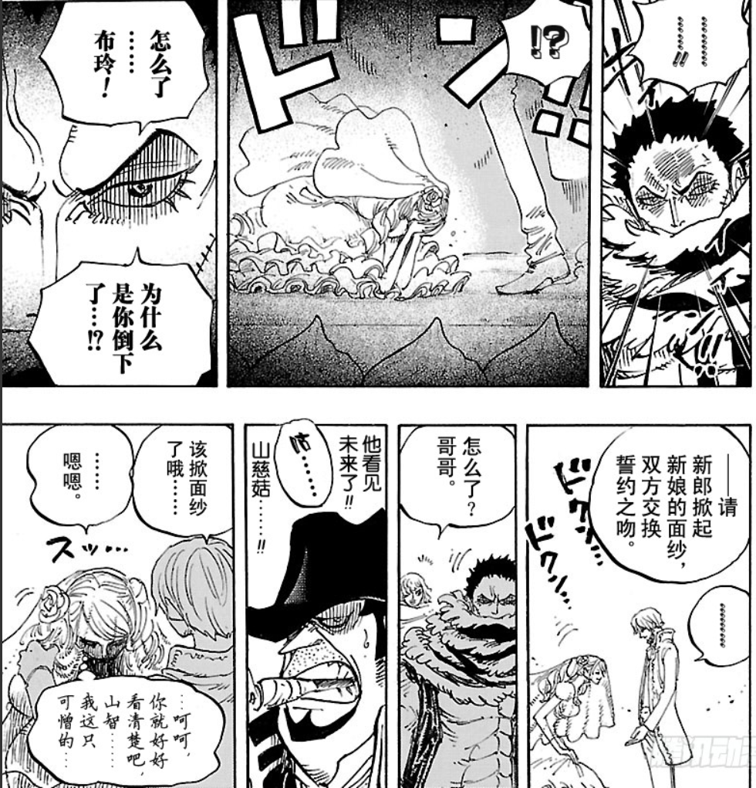
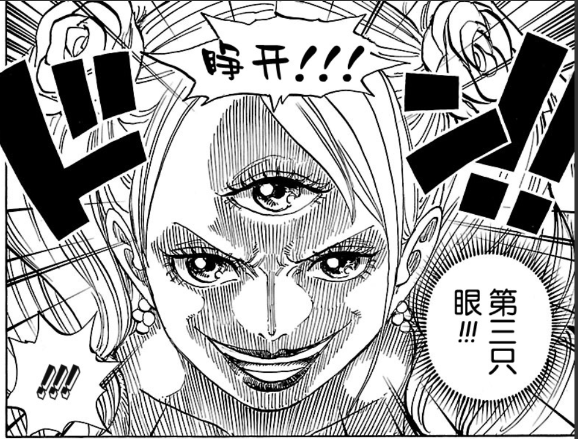
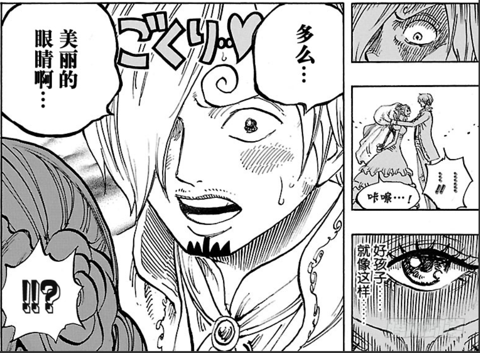
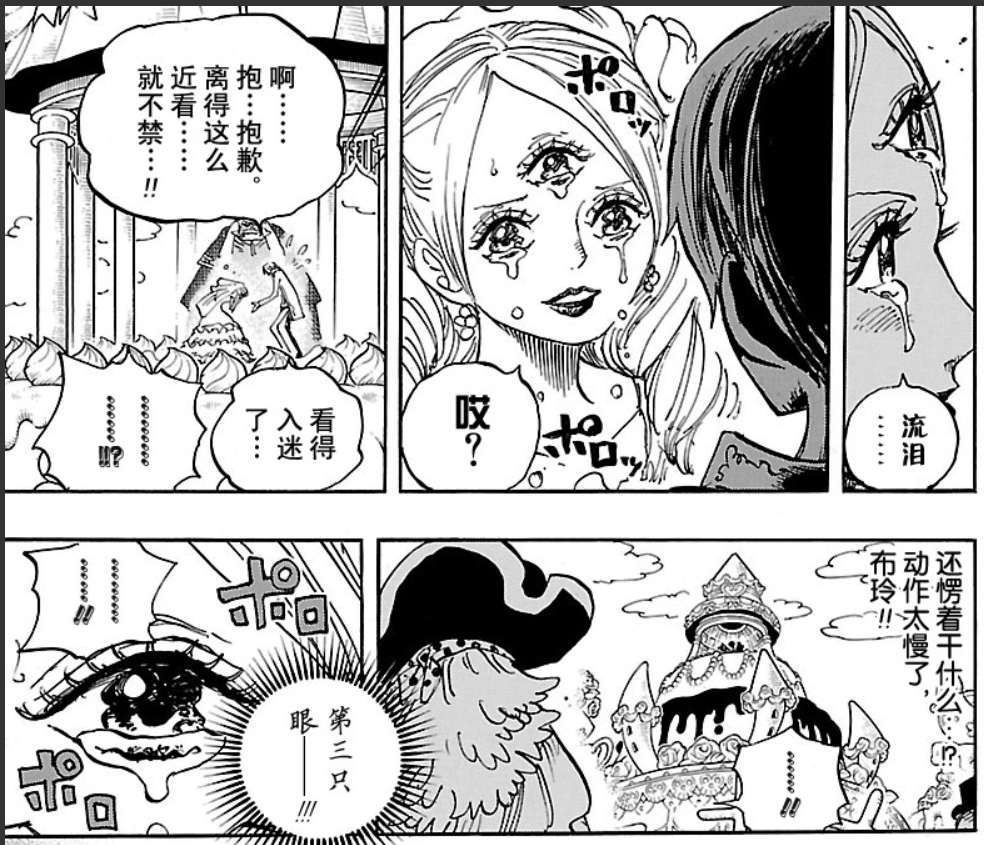
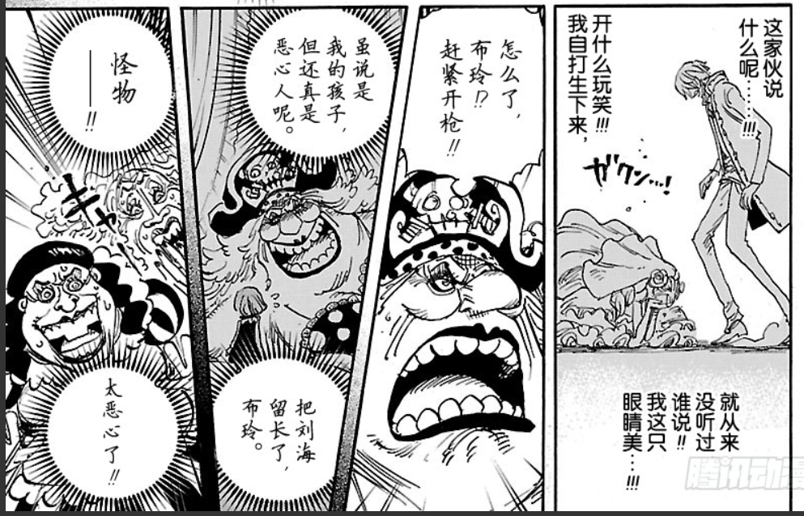
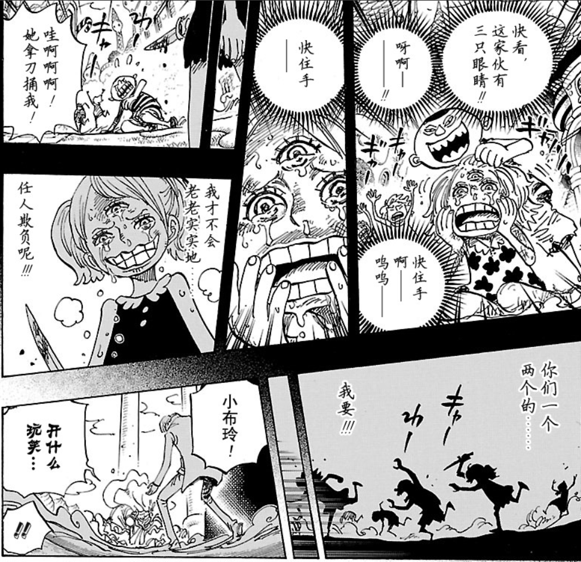

我想，有不少的人，生活在这种家庭背景下吧。被自己的家人否定，其实他们也不单单否定你，他们只是悲观，无法看到美好的另一面。有一个会相信自己，鼓励自己的朋友、长辈，真的是很幸运的一件事。本来你以为世界很黑暗，四周都走投无路，可是那些能看到生活美好一面的人，会突然就让你的世界变得明亮。嘲笑你的朋友，讽刺你的家人，一定是比孤单还可怕的事吧。大海那么大，希望每个人都能找到能保护自己梦想的伙伴。
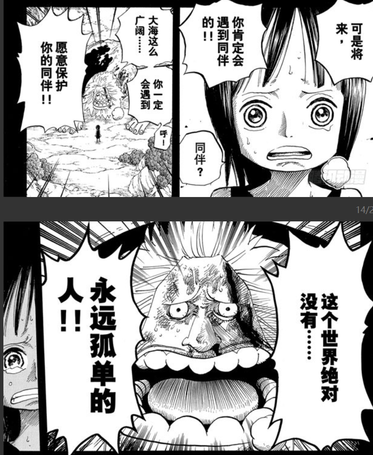
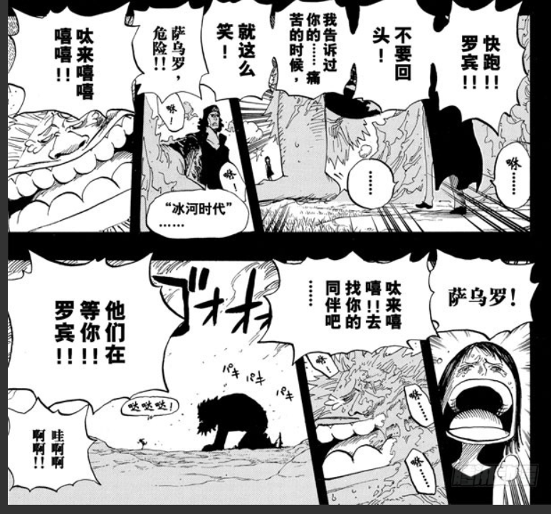
