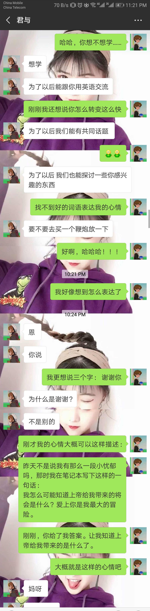

昨天我又和她说了一大堆。基本是关于如何让我们的感情变得稳固的。她本来说，希望我们的恋情至少能持续个3~5年，可我觉得这3~5年太短。有些东西并不需要等到3~5年过后才知道它能持续很久，而是在你看到它了解它的那一刻起你就能断定，这是永恒的，还是暂时的。所以我鼓励我们都去发现对方独一无二的一面，并爱上这个独一无二的对方。

具体上，我希望她学习编程和英语，就如同她陪我下棋，最终她也找到了了取。那么编程和英语，兴许也是这样的。我在编程中是能找到不少乐趣的，英语的学习过程虽然不怎么开心。但到用时方恨少。

我问她，你想学英语吗？她一开始老是皱眉，表示不想学。昨晚我再问的时候，得到了这样的回答：
 
