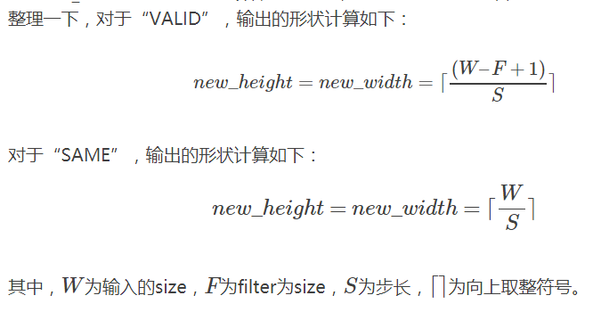

## TensorFlow 卷积输入输出大小

The TensorFlow Convolution example gives an overview about the difference between SAME and VALID :
For the SAME padding, the output height and width are computed as:

`out_height = ceil(float(in_height) / float(strides[1])) `

`out_width = ceil(float(in_width) / float(strides[2]))`

And for the VALID padding, the output height and width are computed as:

`out_height = ceil(float(in_height - filter_height + 1) / float(strides1))`

`out_width = ceil(float(in_width - filter_width + 1) / float(strides[2]))`

***
###反卷积
又一个很重要的部分！tf.nn.conv2d中的filter参数，是[filter_height, filter_width, in_channels, out_channels]的形式，而tf.nn.conv2d_transpose中的filter参数，是[filter_height, filter_width, out_channels，in_channels]的形式，注意in_channels和out_channels反过来了！因为两者互为反向，所以输入输出要调换位置

卷积与反卷积可以共享kernal！

<a href="http://blog.csdn.net/mao_xiao_feng/article/details/71713358"> ** For More Detail **</a>