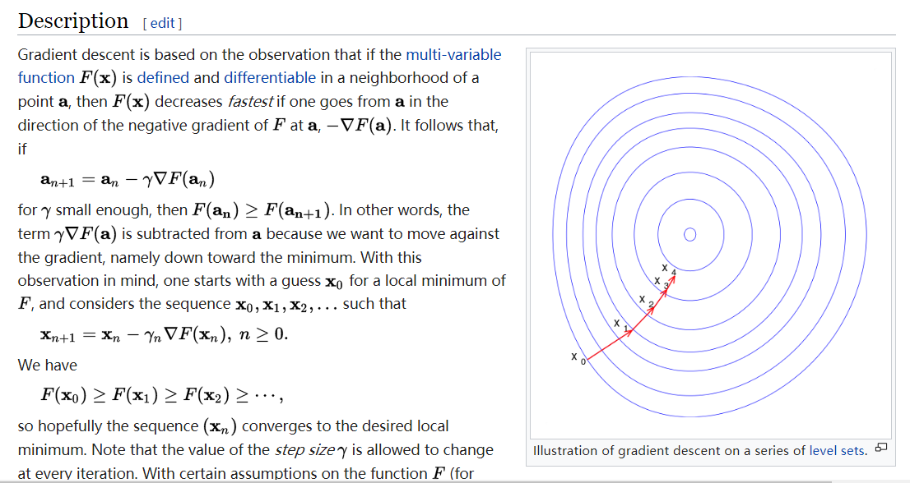

### 在此记录这些天学习神经网络的一些所思所想以及一些tip。
****
#### 学习过程
我前些日子在网上发现这个<a href='http://neuralnetworksanddeeplearning.com/'>网站</a>学习了上面的资料——这是能找到的最好的学习资料了，从神经网络的数学基础到高层大厦，都解释的很简单易懂。最重要的是2、3、6这三章。其中第2章比较数学，最数学吧，但是看懂它基本神经网络就看懂了，看懂的前提是需要懂得<a href='https://en.wikipedia.org/wiki/Gradient_descent'>梯度下降法。</a>还要深刻理解它，之后自己想出梯度下降如何与bp算法结合。

之后就可以看它的附带的fucking source code 了，再之后就能自己会写神经网络了。一开始看源码还有点勉强，隔几天再看，哇，简单了好多啊。看源码的时候注意分析bp算法矩阵的rows and columns，这样能有助于记忆以及理解。毕竟是要从底层学习起所以开始theano够用，其它更复杂的工具以后在学习。
#### 一些小创新
目前的神经网络训练时容易有各种各样的问题，我想到一些方法能使得训练时不容易过拟合，并且这方法有时还能增加学习维度。假设神经网络的输入是X，输出是Y。本来，输出Y具有a属性，这也正是需要神经网络学习的，现在想要Y同时具备a、b属性，如何做？这可以通过两个方法完成，一个是先用一个算法对X进行筛选，另一个是为训练增加一个评价函数（Cost Function）。也就是让数据同时满足两个评价函数，进而对权值进行更新。

还有这种情况，假设训练数据X、 Y已经确定，现在要想对X增加一个额外的，与原X不相关的维度k，进而让Y更丰富或者更丰富。但是如何安排这个额外的维度呢？强行塞到原数据矩阵里？如果想让k具有更大的“影响力”呢？这基本都可以通过对训练过程增加另一个评价函数实现！
