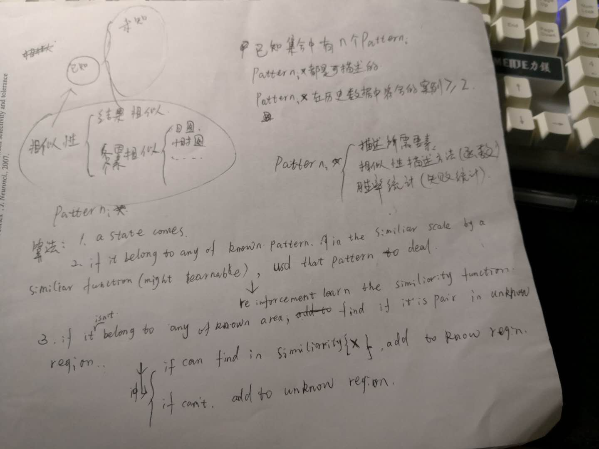

想了很久的强化学习用于策略的自动生成上，发觉没多少进展。而我也自己想到了一个模型，当然也有自主学习在内。是以分类为核心，具体是怎样弄我还没定好。当然，强化学习我还没算会，等到我学会了可能会有更好的模型。

仔细想了一下，图中的相似性函数似乎是难以通过对结果的判断就学习的。因为影响结果毕竟有多个因素：
1. 分类准确性
2. 该pattern的可靠性（pattern本身的胜率）
3. 随机因素

所以分类函数估计得另外想办法学习。