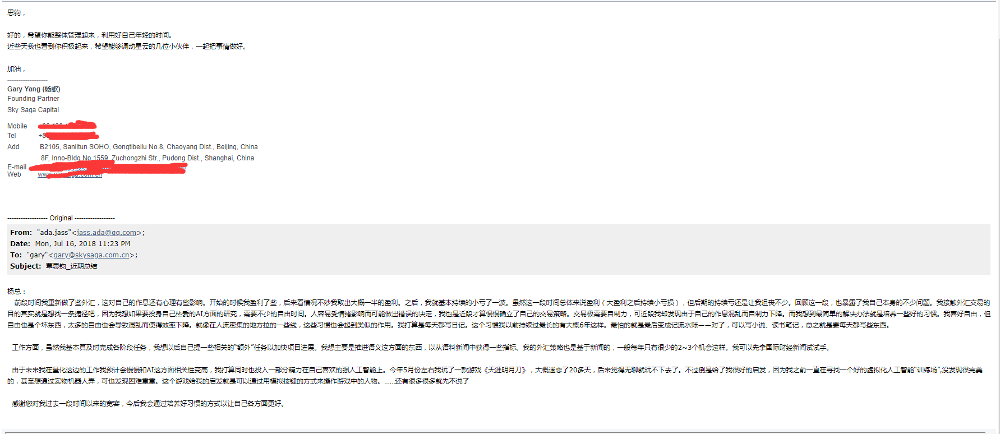

## 这应该是最后的时限了
青春啊，已经到了尾声，还不努力就没了，可梦想还是那么远。令人欣慰的是，我已经找到了路，就剩下大胆的往前走了。以下是我写给boss的email，说了一些我的近况：

现在呢，的确算是我人生的低估区，我外汇那边亏了不少，而我之前还畅想着赚多少多少然后去旅游的。

我的确的坚持，培养好习惯，然后逐步的改变自己。是时候了，变得沉稳，不再顽皮，安于那条自己发现的颠扑不破的逻辑：等待最好的时机，做最好的选择。像老牛一样有耐心，即使寂寞难耐，也会想出各种法子去克服。痛苦着，也快乐着。

“昨夜西风凋碧树。独上高楼，望尽天涯路。” 路已望尽，志已立下，无需再多想，无需再踌躇.只等“衣带渐宽终不悔，为伊消得人憔悴。”。

我只要，每天写一篇日记，每天都在量化和人工智能上取得一点小小的进步。